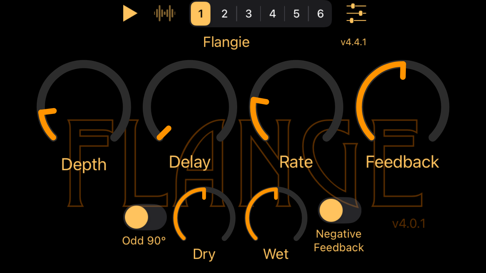
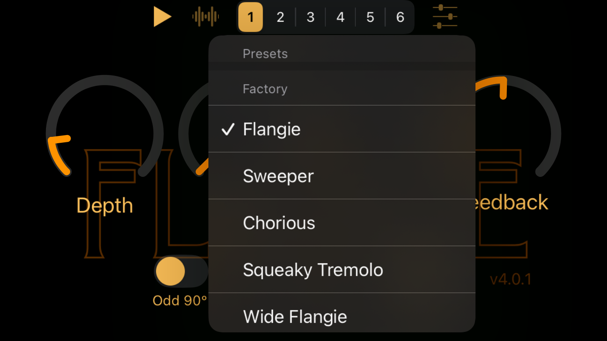
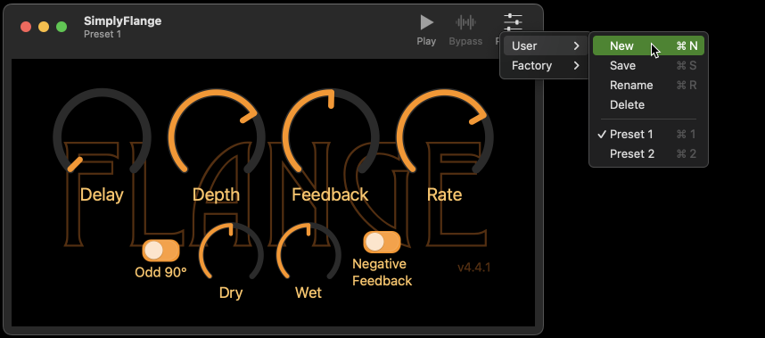

[](https://github.com/bradhowes/AUv3Support/actions/workflows/CI.yml)
[](https://github.com/bradhowes/AUv3Support/blob/main/.github/workflows/CI.yml)
[](https://swiftpackageindex.com/bradhowes/AUv3Support)
[](https://swiftpackageindex.com/bradhowes/AUv3Support)
[](https://opensource.org/licenses/MIT)

# Overview

Swift package containing useful code for AUv3 app extensions. There are four products so far in this package:

- [AUv3-Support](Sources/AUv3Support) -- collection of extensions and classes for both the AudioUnit components that is packaged
  as an AUv3 app extension and the host app that contains it. Because it will be linked to the AUv3 app
  extension, it must not link to or use any APIs that are forbidden by Apple for use by app extensions.
  This code works on both iOS and macOS platforms.
- [AUv3-Support-iOS](Sources/AUv3Support-iOS) -- classes that provide a simple AUv3 hosting environment for the AUv3 app extension.
  Provides an audio chain that sends a sample loop through the AUv3 audio unit and out to the speaker. Also
  provides for user preset management.
- [AUv3-Support-macOS](Sources/AUv3Support-macOS) -- similar to the above but for macOS. Unfortunately, the setup is not
  as straight-forward on macOS as it is for iOS. So far I have not been able to get a good load from a storyboard held
  in this package, where menu items are connected to delegate slots, and toolbar buttons connected to the main window.
  However, it does work when it everything is wired properly.
- [DSPHeaders](Sources/DSPHeaders) -- collection of C++17 headers for classes that are useful when creating AUv3
  kernels. These were written specifically for use in a audio unit render thread, so there should be no memory
  allocations done once a render thread is started.
  
The [EventProcessor](Sources/DSPHeaders/include/DSPHeaders/EventProcessor.hpp) template in the DSPHeaders product serves
as the basis for all AUv3 filter _kernels_. You only need to define your own `doRendering` method to perform the sample
rendering. Pretty much everything else is handled for you. You can define additional methods if you wish, but only the
`doRendering` one is mandatory.

Instead of using C++ virtual functions to dispatch to functionality held in derived classes, `EventProcessor` relies on
the derived class being given as the template parameter. This setup is known as the ["curiously recurring template
pattern" (CRTP)](https://en.wikipedia.org/wiki/Curiously_recurring_template_pattern). The template also uses modern C++
techniques to detect if methods are present in your class, and the compiler only generates code to call them when they
are available.

The [AUv3Template](https://github.com/bradhowes/AUv3Template) project showcases all of this and it is setup to deliver a
working macOS and an iOS app and app extension out of the box with just the run of a command-line script.

## iOS Example

Here are images showing my [SimplyFlange](https://github.com/bradhowes/SimplyFlange) app running in the iPhone SE
simulator in landscape orientation. This app was based on [AUv3Template](https://github.com/bradhowes/AUv3Template) and
so uses the AUv3Support package.



The controls at the top come from the AUv3Support-iOS package as part of the host application infrastructure it
provides. There, you find:

- _play_ button to start/stop audio playing through the filter
- _bypass_ button to disable the filter
- _presets bar_ to quickly choose from a factory preset from the AUv3 extension
- _presets menu_ to show a menu of user and factory presets



The hosting app supports creating and managing user presets for the extension. These should operate in the same way that
they do in other hosting apps such as GarageBand, Logic, Cubasis, AUM. You can create your own presets. When a user
preset is active, you can then:

- _Update_ the preset by saving the current parameter settings under its name
- _Rename_ the preset to give it a new name
- _Delete_ the preset to remove it from the device

## macOS Example

Here is an image showing the macOS version of the same AUv3 plugin. This time the host controls are found in the app's
title bar.



# Other Examples

This repo is also being used by my other AUv3 projects:

* [SoundFonts](https://github.com/bradhowes/SoundFonts)
* [SimplyLowPass](https://github.com/bradhowes/LPF)
* [SimplyFlange](https://github.com/bradhowes/SimplyFlange)
* [SimplyPhaser](https://github.com/bradhowes/SimplyPhaser)
* [SimplyTremolo](https://github.com/bradhowes/SimplyTremolo)

# Swift 6

The latest version now builds with Swift 6 and full concurrency checking.

# Credits

All of the code has been written by myself over the course of several years working on AUv3 app extensions. There are a collection of
routines in [ConstMath](Sources/DSPHeaders/include/DSPHeaders/ConstMath.hpp) that provide compile-time values for sine, natural log, and
exponential function. These are used to generate some lookup tables at compile time. The functions that do this were taken from
Lakshay Garg's [compile_time](https://github.com/lakshayg/compile_time) (no specific license) repo and Keith O'Hara's
[GCEM](https://github.com/kthohr/gcem) (Apache license) repo. I started off with `compile_time` but I lifted the natural log function
from `GCEM`. Note that the use of these compile-time methods are *only* for a very limited set of use-cases, all of which are not that
demanding in terms of precision.

# AUv3Support

In the AUv3-Support product you will find various classes and extensions to make things easier when working with AUv3
components:

- Editors -- a collection of parameter editors that work on iOS and macOS via protocol conformance. They properly
update themselves when an audio unit loads a preset, and they properly communicate changes made by the user or by
another control, perhaps external. There is a
`BooleanParameterEditor` that works with a UISwitch/NSSwitch control, and there is a `FloatParameterEditor` that works
with anything that can report out a floating-point value as well as the min/max ranges the value may have.
- AudioUnitLoader -- a basic AUv3 host that locates your AUv3 component and connects it up
- SimplePlayEngine -- a simple AudioUnit graph that plays audio from a file and sends it through the loaded
  component and then to the speaker.
- UserPresetManager -- manages the user presets of an AUv3 component
- Extensions -- folder with sundry extensions that makes life better
- Resources -- audio files that can be played using the `SimplePlayEngine`. Useful when demoing a filter.

# AUv3Support-iOS

Contains most of what is needed for a simple AUv3 host that will load your AUv3 component, show its UI controls, and
allow you to play audio through it. The basics for getting it to work are:

1. Create a `HostViewConfig` that contains values specific to your AUv3 component and then pass it to the
`Shared.embedHostView` static function along with your app's main `UIViewController` instance.
2. Modify your `AppDelegate.swift` file to inherit from the AppDelegate found in this package. Something like this is
good:
```swift
import UIKit
import AUv3Support
import AUv3Support_iOS
import os.log

@main
final class AppDelegate: AUv3Support_iOS.AppDelegate {
  // NOTE: this special form sets the subsystem name and must run before any other logger calls.
  private let log: OSLog = Shared.logger(Bundle.main.auBaseName + "Host", "AppDelegate")
}
```
3. Modify your `MainViewController.swift` to do the following:
```swift
import AUv3Support
import AUv3Support_iOS
import CoreAudioKit
import UIKit

final class MainViewController: UIViewController {

  private var hostViewController: HostViewController!

  override func viewDidLoad() {
    super.viewDidLoad()

    guard let delegate = UIApplication.shared.delegate as? AppDelegate else { fatalError() }

    let bundle = Bundle.main
    let component = AudioComponentDescription(componentType: bundle.auComponentType,
                                              componentSubType: bundle.auComponentSubtype,
                                              componentManufacturer: bundle.auComponentManufacturer,
                                              componentFlags: 0, componentFlagsMask: 0)

    let config = HostViewConfig(name: bundle.auBaseName, version: bundle.releaseVersionNumber,
                                appStoreId: bundle.appStoreId,
                                componentDescription: component, sampleLoop: .sample1) { url in
      UIApplication.shared.open(url, options: [:], completionHandler: nil)
    }

    let hostViewController = Shared.embedHostView(into: self, config: config)
    delegate.setStopPlayingBlock { hostViewController.stopPlaying() }
    self.hostViewController = hostViewController
  }
}
```
4. That's all!

The `Actions` folder contains flows for managing user presets such as creating, deleting and renaming. The `HostView`
storyboard holds a set of UI elements that are useful for a AUv3 demonstration app.

# AUv3Support-macOS

Unlike the above, macOS is a bit more involved because I have yet to get something simpler up and running. The big issue
is getting the application's delegate, main window, and main view controller all established and functional when
unpacked from a package. So, until that is accomplished, one must pass a bucket-load of UI elements in a
`HostViewConfig` and instantiate a `HostViewManager` with it. This should be done as early as possible, but it cannot be
done before the main view controller has a window assigned to it. So, the best option is to do something like below,
where we monitor for a window being set on the view. The only remaining task is to show the initial prompt to the user
on first-time launch.

```swift
  override func viewDidLoad() {
    super.viewDidLoad()

    // When the window appears, we should be able to access all of the items from the storyboard.
    windowObserver = view.observe(\.window) { _, _ in self.makeHostViewManager() }
  }

  func makeHostViewManager() {
    guard let appDelegate = appDelegate,
          appDelegate.presetsMenu != nil,
          let windowController = windowController
    else {
      fatalError()
    }

    let bundle = Bundle.main
    let audioUnitName = bundle.auBaseName
    let componentDescription = AudioComponentDescription(componentType: bundle.auComponentType,
                                                         componentSubType: bundle.auComponentSubtype,
                                                         componentManufacturer: bundle.auComponentManufacturer,
                                                         componentFlags: 0, componentFlagsMask: 0)
    let config = HostViewConfig(componentName: audioUnitName, componentDescription: componentDescription,
                                sampleLoop: .sample1,
                                playButton: windowController.playButton,
                                bypassButton: windowController.bypassButton,
                                presetsButton: windowController.presetsButton,
                                playMenuItem: appDelegate.playMenuItem,
                                bypassMenuItem: appDelegate.bypassMenuItem,
                                presetsMenu: appDelegate.presetsMenu,
                                viewController: self, containerView: containerView)
    hostViewManager = .init(config: config)
  }

  override func viewDidAppear() {
    super.viewDidAppear()
    hostViewManager?.showInitialPrompt()
  }
```

Not great, but not too cumbersome to use now. And it is nice to have abstracted out all of the common functionality my
audio unit apps share.

